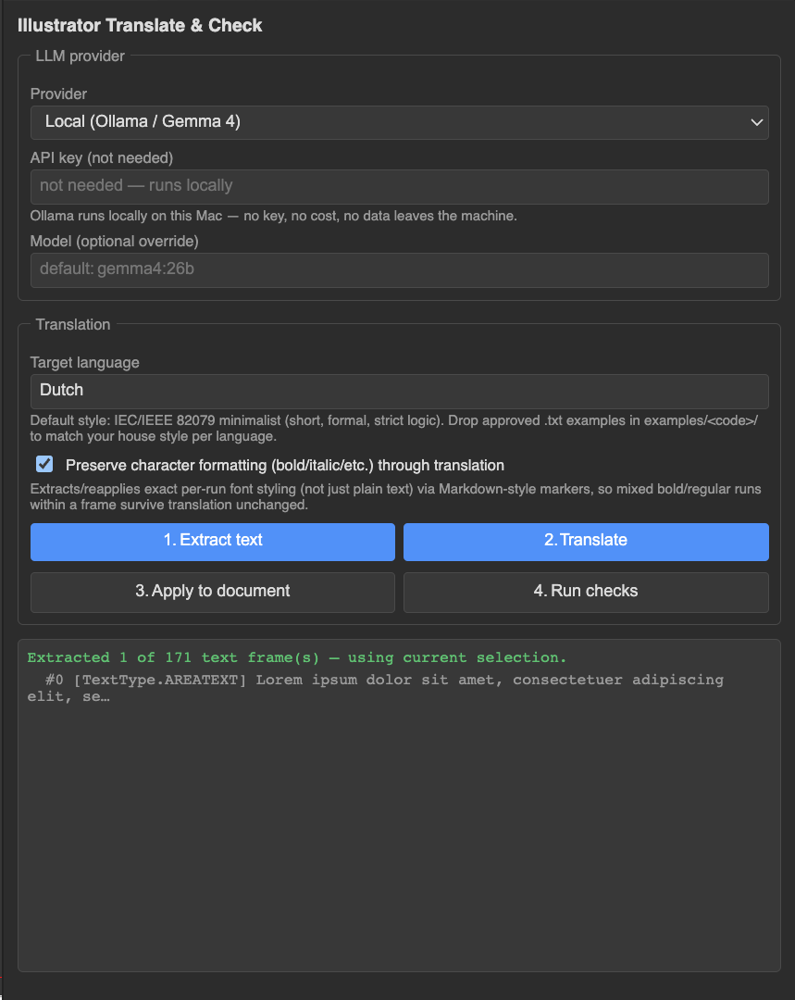

# Illustrator Translate & Check (macOS)

CEP panel for Adobe Illustrator that extracts text frames from a document,
sends them to an LLM for translation, writes the result back into the same
frames, and runs a handful of QA checks (overset text, leftover untranslated
strings, missing glyph support) — all without leaving Illustrator.

Panel-side JS drives the UI and calls the LLM provider directly over
`fetch`; an ExtendScript host (`jsx/host.jsx`) does the actual document
read/write inside Illustrator's scripting engine.

## Screenshot

## Status

- Extract text frames — current selection (whole frames, or just a
  Type-tool-dragged range within one), or the whole document if nothing is
  selected
- Translate via one of four providers: local Ollama, Claude, ChatGPT, Gemini
- Optional formatting-preserving mode — captures per-run font/size/color/
  underline/tracking as inline markers so mixed bold/regular text survives
  translation unchanged, including on the untouched prefix/suffix of a
  partial-selection edit
- Apply translated text back to the original frames (or just the selected
  sub-range)
- Per-language style examples (`examples/<lang-code>/*.txt`) fed to the LLM
  as house-style reference
- Checks: overset text frames, untranslated leftovers, font/script glyph
  support (heuristic registry, not real font introspection)

## Install

**Read [`SECURITY.md`](SECURITY.md) first** — installing this enables
Adobe's `PlayerDebugMode`, which is not scoped to just this extension.

Run [`./install-mac.sh`](install-mac.sh) (prints the same warning and asks
for confirmation before changing anything), or follow the manual steps in
[`install-mac.md`](install-mac.md).

## Usage

1. Select a target language (e.g. `German (de)`) and, if using a hosted
   provider, paste an API key — stored only in the panel's local storage on
   this Mac.
2. **1. Extract text** — pulls text frames from the current selection, or
   the whole document if nothing is selected.
3. **2. Translate** — batches frames to the chosen provider (chunked by
   character count so long documents don't get cut off mid-reply).
4. **3. Apply to document** — writes translated text back into the same
   frames by index.
5. **4. Run checks** — flags overset frames, untranslated leftovers, and
   fonts that may not cover the scripts used in the translated text.

Providers:

| Provider | Needs API key | Notes |
|---|---|---|
| Ollama (local) | No | `http://localhost:11434`, default model `gemma4:26b` — no cost, nothing leaves the machine |
| Claude (Anthropic) | Yes | default model `claude-sonnet-5` |
| ChatGPT (OpenAI) | Yes | default model `gpt-4o` |
| Gemini (Google) | Yes | default model `gemini-2.5-flash` |

## Style examples

Drop approved `.txt` snippets in `examples/<lang-code>/` (folders already
present: `en`, `de`, `fr`, `cs`, `pl`, `nl`) to steer tone/terminology per
language. Empty or missing folder = default IEC/IEEE 82079 minimalist style
only. See `examples/README.txt`.

For how the prompt itself is built (and how to change it), see
[`CUSTOMIZATION.md`](CUSTOMIZATION.md).

## Limitations

- Text-frame `id`s are index positions into `doc.textFrames` — the document
  must not gain/lose/reorder text frames between Extract and Apply.
- "Missing glyph support" is a manual font→script registry
  (`js/checks.js`), not real font introspection — Illustrator's scripting
  API can't query a font file's actual glyph coverage. Extend
  `FONT_SCRIPT_SUPPORT` for fonts not already listed.
- Formatting-preserving mode assumes source text has no literal `<<`/`>>`
  sequences.
- Illustrator's scripting API has no documented way to assign `.contents`
  to an arbitrary sub-range of a text frame, so a partial-selection edit is
  applied by rewriting the whole frame's text and re-striping the
  untouched prefix/suffix from captured formatting runs — this preserves
  the visible result but isn't a true in-place partial write.

## License

MIT — see [LICENSE](LICENSE).
