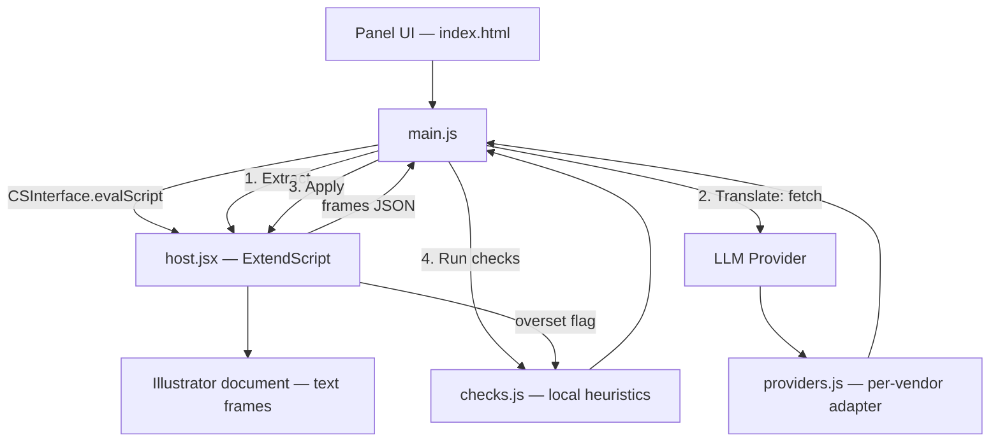

# Illustrator Translate & Check — Architecture

## High-level flow

## Component map

| Layer | Component | Detail doc |
|---|---|---|
| Panel | UI + workflow state machine | [[modules/Panel_UI]] |
| Panel | LLM provider adapters | [[modules/Providers]] |
| Panel | QA heuristics (overset relay, leftover text, glyph support) | [[modules/Checks]] |
| Host | ExtendScript extraction/apply/overset detection | [[modules/Host_Script]] |

## Architecture decisions

### CEP over UXP
See [[00_Project_Vision]] — decided by capability, not preference: the
formatting-preservation feature needs per-character `characterAttributes`
read/write, which CEP's ExtendScript DOM exposes directly.

### Frame identity is a document-order index, not a stable ID
`extractTextFrames()`/`extractTextFramesMD()` number frames by their
position in `doc.textFrames` at extraction time; `applyTranslations*()` and
`checkOverset()` re-index that same collection later. Illustrator has no
persistent per-object ID exposed to scripting, so this is the cheapest
correct option — but it means the document must not gain, lose, or reorder
text frames between Extract and Apply. This constraint is enforced by
convention (user workflow), not code — there's no snapshot/guard against a
mid-workflow edit.

### Formatting preserved via numbered tags, not Markdown `**`
A shared delimiter like Markdown's `**bold**` can't disambiguate which
closing marker belongs to which opening one once a translator/LLM drops or
shifts one. `<<m1>>...<</m1>>`, `<<m2>>...<</m2>>` markers are uniquely
numbered per run occurrence, so a dropped or malformed tag can only corrupt
its own span, never cascade into unrelated text. Full detail in
[[modules/Host_Script]].

### Host script is loaded explicitly, not via manifest autoload
The CEP manifest's `<ScriptPath>jsx/host.jsx</ScriptPath>` did not reliably
register top-level functions in the CEP/Illustrator combination this was
tested against, so `main.js` explicitly `$.evalFile()`s it on panel load
and self-checks that `extractTextFrames`/`extractTextFramesMD` came back as
functions (see `loadHostScript()` in [[modules/Panel_UI]]).

### Providers are peer adapters, not a primary + fallbacks
`providers.js` gives each of Ollama/Claude/ChatGPT/Gemini the same
three-method shape (`buildRequest`, `extractText`, plus metadata). Prompt
construction, batching, and JSON re-parsing are shared in `main.js`; only
the wire format differs per vendor. See [[modules/Providers]].
